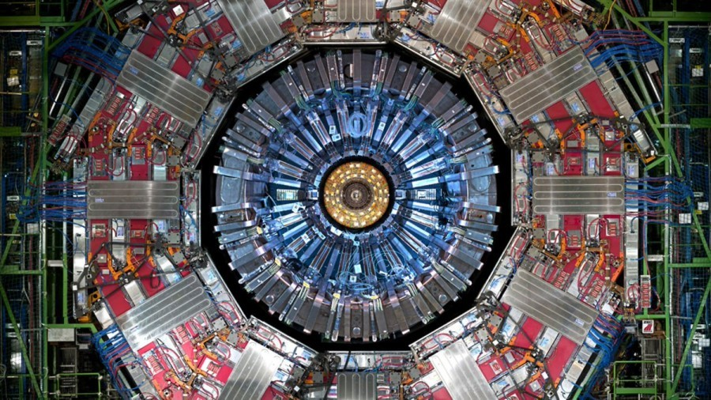

# ITÜ Summer School July 2019
## Music and Mathematics

What is music?

+ No matter the style, music is a collection of sounds that
are organized in a timely manner.

From Pythagoras to Stochastic Music of Iannis Xenakis.


Electronic Music and digital instruments.


Program a unique instrument on our computer using code.

+ Let's see this example below:

```js
Pbind(\dur, 0.25, \degree, Pseq([1, 2, 3], inf)).play;
```
v.s
```js
Pbind(\dur, 0.25, \degree, Pseq([3, 2, 1], inf)).play;
```

And let's add some more notes:
```js
Pbind(\dur, 0.25, \degree, Pseq([3, 5, 6], inf)).play;
```

And some fun with playing the numbers in different order.

```js
Pbind(\dur, 0.25, \degree, Prand([1, 2, 3, 5, 6], inf)).play;
```

Let's make a mathematical function that will create notes in a minor
scale only.

```js
~synth = {|freq = 220| CombC.ar( LFTri.ar([freq, freq * 2.01], 0, 0.1) )}.play;

(
~interval = 0.5;
~series = 10;


~change_freq = {
	var freq = 220.0;
	freq = freq * Array.series(~series, ~interval, 0.25).choose;
	~synth.set(\freq, freq);
	("- frequency is: " ++ freq).postln
}
)

fork({ loop{ 0.1.wait; ~change_freq.value;} });
```

Dark Matter, Music from CERN.



Using the numbers/data from the collision.


IPSOS web app. Using the data from the Dark Matter to create sounds
(http://ipsos.web.cern.ch/)
